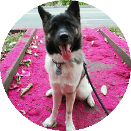
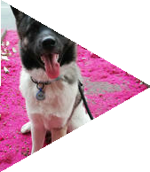
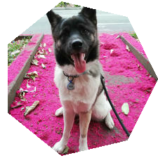
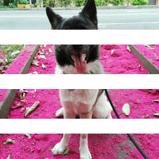

# Image Scandumper

Feed it directories and it shall search images from there producing resized and transformed versions of the original.

What sort of transformed images it produces you might ask.

See the `resized` directory from [example](example) dir for an example output.

__You should see for instance.. My dog in a triangle-ball-triangle!__  




__Dog in a box!__  




__Now the dog goes all small and gray__  


__Yep, he's a star__  


You get the picture, no more dog.  
Try to feed your own images into it and see how it goes!

Resized images can be used on your website for example. Smaller images == faster load times.

## It scans

You need `config.toml` file on the root of a directory you wish to read the images from.  
See example [config](example/config.toml) what can be defined for the scanner.

Without limitations all subdirectories will be walked and all files tested if they read as an image of known sort.  
By default it processes 4 source images at a time, first resizing them and then running the transformations on the given size variant (medium if not set in config).

It rebuilds a matching directory tree for the output. Image file name without the extension is used as the parent directory for all resized and transformed images.

To do a fast test you can run the following command from project directory:

```bash
cargo run --bin scandumper example
```

If no changes to the default [config](example/config.toml) were made this should give you `resized` dir next to the `config.toml`:

- example/
  - source_files / _(scanned)_
  - other_source_files / _(scanned)_
  - config.toml
  - resized /
    - source_files/
      - one /
        - two /
          - apartments-1845884_640 / _(resized image)_
          - chili-4656603_1920 / _(resized image)_
    - other_source_files/
      - pineapples-576576_1280 / _(resized image)_
      - tools-498202_1280 / _(resized image)_

## It dumps

Resized and transformed images are not that useful when kept as bytes in memory.  
So let's take a dump somewhere.

__Filesystem__
Read from the filesystem, write there too. If requested.  
Configuration has the `export` setting for this:

```toml
[export]
filesystem = true
```

As explained in the example above, this setup recreates the scanned directory tree for the resized images.

Using the filesystem for writes is straight forward, easy and fast but not that useful if you plan to share your resized images with the world.

__Object store__
S3 compatible object store can be be used as a dump target for wider range of use cases.  
To try this you might want to do it [locally](https://min.io/docs/minio/linux/operations/install-deploy-manage/deploy-minio-single-node-single-drive.html#minio-snsd) first with [Minio](https://min.io).  
Config should be modified to following before proceeding:

```toml
[export]
s3 = true
```

If your local S3 instance can be connected to and you've created a bucket called `images` in it, we should be good to go.  
Running the command:

```bash
cargo run --bin scandumper example
```

Uploads all images into your local minio instance.

### More on the S3 testing locally

First [install minio](https://min.io/docs/minio/linux/operations/install-deploy-manage/deploy-minio-single-node-single-drive.html#minio-snsd) on your computer.

To try the example you have to have minio instance up and running

```bash
minio server example/minio --address localhost:9090
```

If above command is executed within the project dir, minio database is stored inside the example dir.  
Only the port `9090` is important really.

Minio is by nature a server and process should never terminate. Since we're kicking the tyres here lets just open up a new terminal tab for the next steps and leave minio running alone here.  
`Shift + Ctrl + t` should give you a new terminal tab to play with.

Before running `scandumper`, log in to your minio admin panel and create bucket `images`

### S3 image server example

Server reads images from running S3 object store and returns:  

- their bytes with suitable mime type
- json arrays or objects of images in the bucket

To try a server that reads from the S3 and returns images it's expected that:

1. You followed the example of setting up a local minio instance
2. Executed scandumper once to upload images to S3
3. Still have S3 export enabled on `config.toml`

```toml
[export]
s3 = true
```

From a new terminal tab run following command:

```bash
cargo run --bin imgserver example 
```

Should display something like this:  

``` bash
2024-05-28T10:41:35.146339Z DEBUG imgserver: Config loaded...
2024-05-28T10:41:35.146374Z DEBUG imgserver: Server config loaded...
2024-05-28T10:41:35.146389Z DEBUG imgserver: Export config loaded...
2024-05-28T10:41:35.162993Z DEBUG imgserver: S3 config loaded...
2024-05-28T10:41:35.163173Z  INFO imgserver: Listening on http://127.0.0.1:9080...
```

Now you can test how images are fetched from S3 object store and returned 'as images'.  
Http responses need content-type header telling the browser what kind of an data it just received. In case of images `image/png` or `image/jpeg` mime type is used.

#### Index from a path

Using a curl or browser: `http://127.0.0.1:9080/s3/index/example`  

```json
{"status":"200 OK","data":["example/resized/"]}
```

Proceed to `resized`: `http://127.0.0.1:9080/s3/index/example/resized`  

```json
{"status":"200 OK","data":["example/resized/other_source_files/","example/resized/source_files/"]}
```

#### List objects from index

Using a curl or browser: `http://127.0.0.1:9080/s3/list/example/resized/other_source_files/three/tools-498202_1280`  

```json
{"status":"200 OK","data":["example/resized/other_source_files/three/tools-498202_1280/lg.jpeg","example/resized/other_source_files/three/tools-498202_1280/md.jpeg","example/resized/other_source_files/three/tools-498202_1280/og.jpeg","example/resized/other_source_files/three/tools-498202_1280/sm.jpeg","example/resized/other_source_files/three/tools-498202_1280/xl.jpeg","example/resized/other_source_files/three/tools-498202_1280/xs.jpeg"]}
```

Proceed to `shapes`: `http://127.0.0.1:9080/s3/list/example/resized/other_source_files/three/tools-498202_1280/shapes`  

```json
{"status":"200 OK","data":["example/resized/other_source_files/three/tools-498202_1280/shapes/cross.png","example/resized/other_source_files/three/tools-498202_1280/shapes/down.png","example/resized/other_source_files/three/tools-498202_1280/shapes/hex.png","example/resized/other_source_files/three/tools-498202_1280/shapes/left.png","example/resized/other_source_files/three/tools-498202_1280/shapes/right.png","example/resized/other_source_files/three/tools-498202_1280/shapes/round.png","example/resized/other_source_files/three/tools-498202_1280/shapes/row2.png","example/resized/other_source_files/three/tools-498202_1280/shapes/row3.png","example/resized/other_source_files/three/tools-498202_1280/shapes/row4.png","example/resized/other_source_files/three/tools-498202_1280/shapes/sep.png","example/resized/other_source_files/three/tools-498202_1280/shapes/sq45.png","example/resized/other_source_files/three/tools-498202_1280/shapes/star.png","example/resized/other_source_files/three/tools-498202_1280/shapes/up.png"]}
```

#### Get image from object

Using a browser: `http://127.0.0.1:9080/s3/get/example/resized/other_source_files/three/tools-498202_1280/shapes/row4.png`

Should respond with image bytes and appropriate content-type header set up.  
Image like this but without the dog should pop up on your browser window:  

